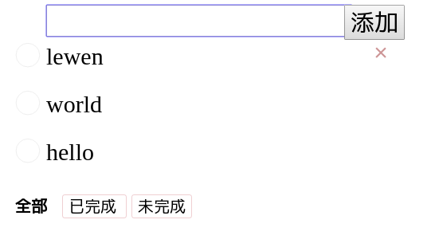

# trivial-todo-list [an old toy:see_no_evil:]

-------------------------------------------------------------------------------
TODO
- [x] Skeleton
- [x] Features completion
- [ ] Engaging UI
- [ ] Friendly README


### 项目描述
- 使用create-react-app建立起项目的脚手架
- redux运用于应用状态管理
- 实现基本的待办事项应用的功能


### Current Status Show


### Installation
```shell
git clone https://github.com/lewenweijia/trivial-todo-list.git
cd trivial-todo-listl
yarn install
yarn start

# To build the app for production, run the following command:
yarn build
```


### LICENSE
MIT
